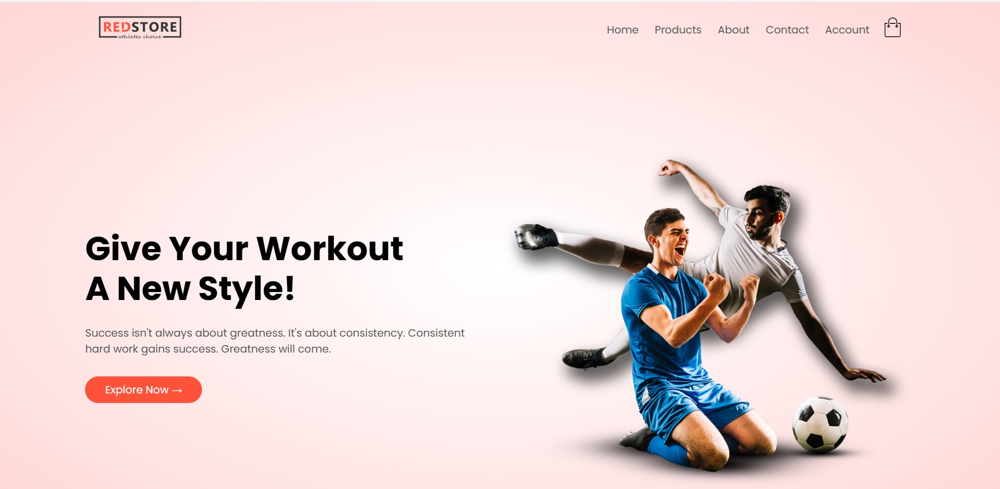
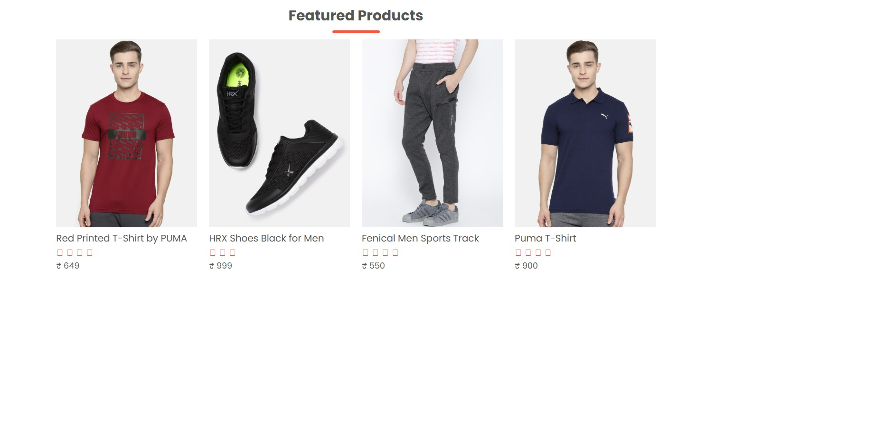
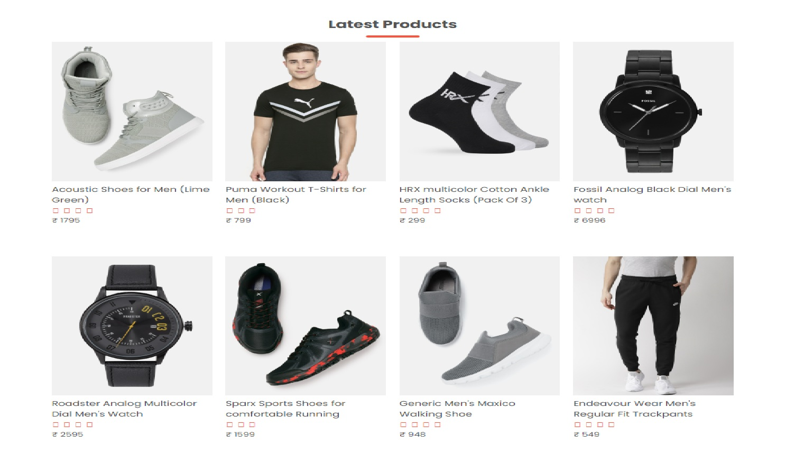
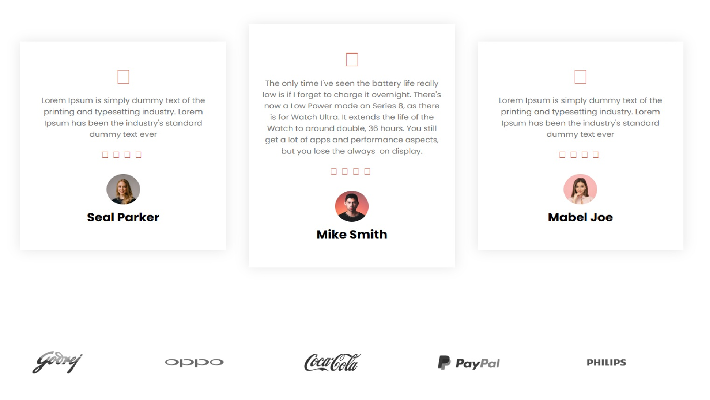
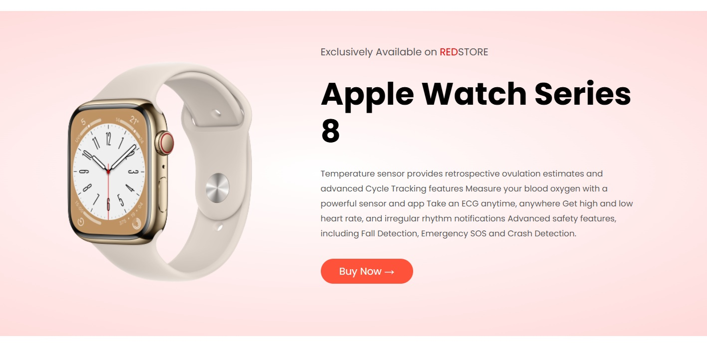
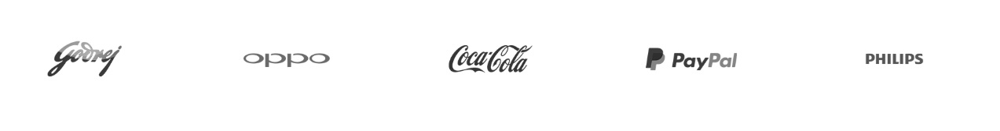
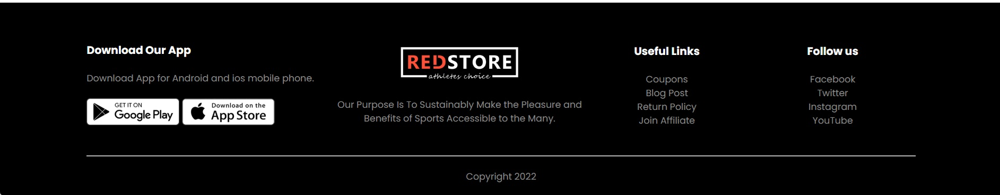

# 🛍️ RedStore  
**A Modern E-Commerce Website for Sportswear and Accessories**  

RedStore is a responsive **e-commerce website** built with **HTML, CSS, and JavaScript**, designed to showcase and sell sports-related apparel, shoes, watches, and accessories. The website provides a clean UI/UX with product listings, categories, testimonials, and shopping features.  

---

## ✨ Features  

### 🏠 Home Page  
- Hero section with promotional banner  
- Navigation bar with logo, links (Home, Products, About, Contact, Account)  
- Responsive design with a collapsible mobile menu  

📸 Screenshot:  
  

---

### 📂 Categories  
- Featured **product categories** for quick browsing  
- Category images displayed in a responsive grid  

📸 Screenshot:  
  

---

### ⭐ Featured & Latest Products  
- Grid layout for **featured products**  
- Includes product name, image, price, and rating  
- **Latest products** displayed in a similar grid  

📸 Screenshot:  
  
  

---

### 🎁 Special Offer Section  
- Exclusive **Apple Watch Series 8 offer** highlighted  
- Includes promotional text and call-to-action button  

📸 Screenshot:  
  

---

### 🗣️ Testimonials  
- Customer reviews with star ratings  
- Profile images and names for authenticity  

📸 Screenshot:  
  

---

### 🏢 Brands Section  
- Logos of partner/featured brands (Godrej, Oppo, Coca-Cola, PayPal, Philips)  

📸 Screenshot:  
  

---

### 📱 Footer Section  
- App download links (Google Play & App Store)  
- Purpose/brand message  
- Useful links (Coupons, Blog Post, Return Policy, Join Affiliate)  
- Social media links (Facebook, Twitter, Instagram, YouTube)  

📸 Screenshot:  
  

---

## 🛠️ Tech Stack  

- **HTML5** – Structure of the website  
- **CSS3** – Styling, layout, and responsiveness  
- **JavaScript** – Navbar toggle and interactivity  
- **Font Awesome** – Icons for ratings and UI elements  
- **Google Fonts (Poppins)** – Clean and modern typography  

---

## 🚀 Installation  

1. Clone the repository:  
```bash
git clone https://github.com/Pranavadi9702/RedStore-E_Commerce_App.git
cd redstore
